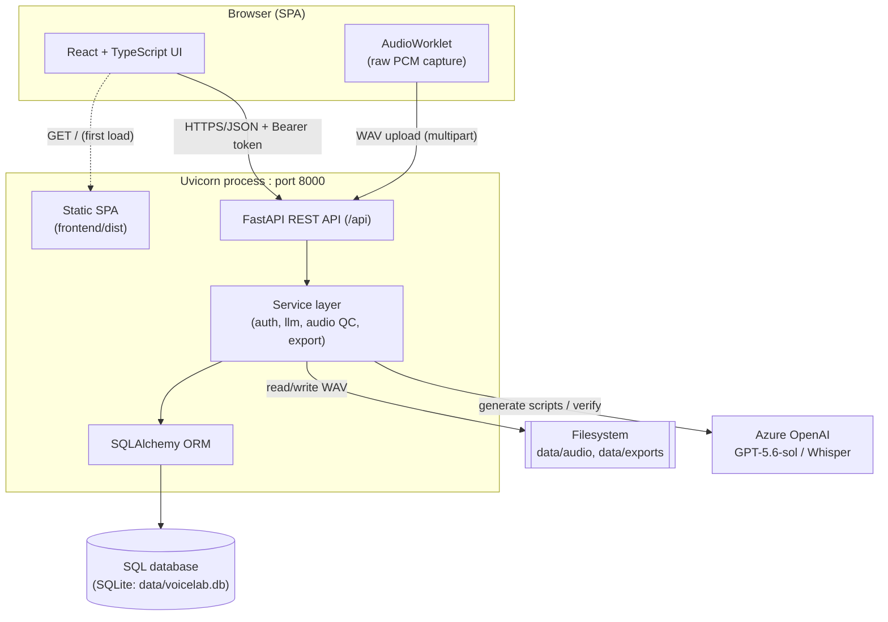
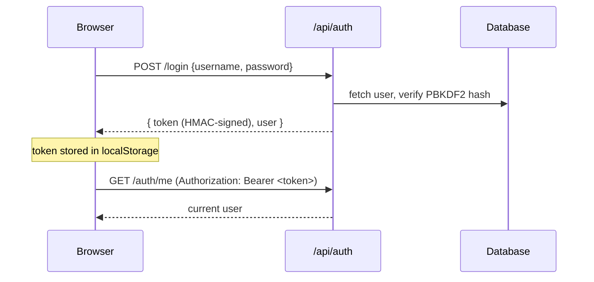
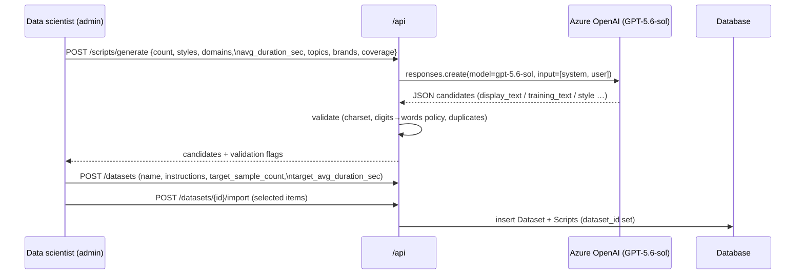
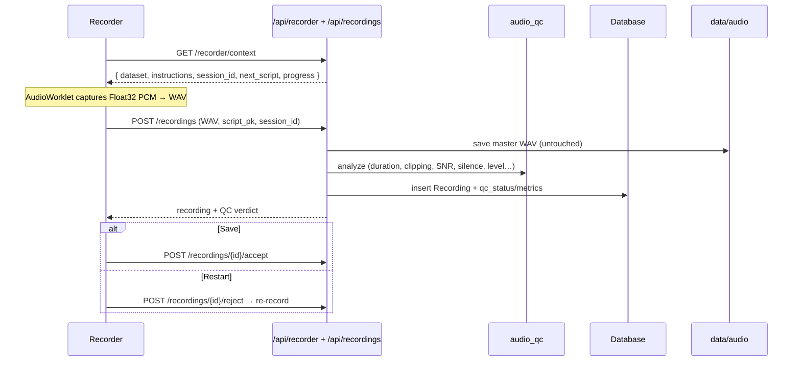
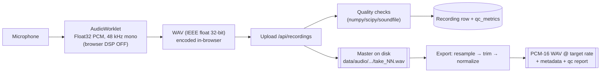
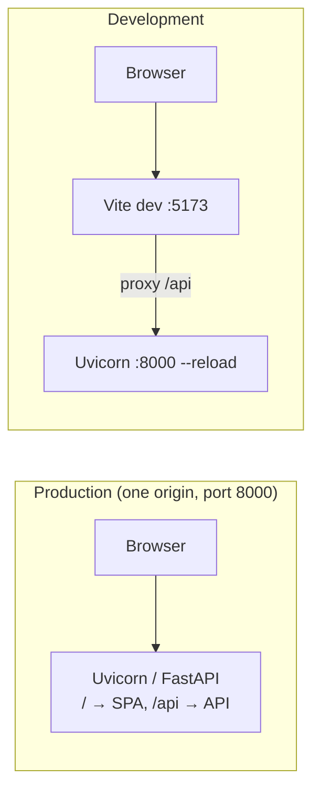

# Architecture

e& Lahja Studio is a **local-first, single-process web application**: one Python
(FastAPI) server exposes a REST API and also serves the compiled React
single-page app. There is no separate app server, message broker, or external
database required to run it — everything defaults to the local machine.

- **Backend:** Python 3.11+, FastAPI, SQLAlchemy, served by Uvicorn (ASGI).
- **Frontend:** React + TypeScript SPA built by Vite, served as static files by
  the same Uvicorn process.
- **Database:** SQL via SQLAlchemy — SQLite by default, PostgreSQL/Oracle by
  configuration.
- **Storage:** audio WAV masters and dataset exports on the local filesystem.
- **External service:** Azure OpenAI (GPT-5.6-sol) for GenAI script generation
  and, optionally, Whisper for advisory ASR verification.

---

## 1. System overview



The browser loads the SPA once, then talks to the API with JSON over HTTP,
authenticating every request with a bearer token. Audio is uploaded as WAV
files. The server persists relational data to the database and audio files to
disk, and calls Azure OpenAI when GenAI generation or ASR verification is used.

---

## 2. Component layers

### 2.1 Backend (`backend/app`)

```
backend/app
├── main.py            App wiring: routers, CORS, static SPA mount, startup
├── config.py          Pydantic settings (.env authoritative), thresholds
├── db.py              Engine/session factory, table creation, migrations, seeding
├── deps.py            Auth dependencies (get_current_user / require_admin)
├── models.py          SQLAlchemy ORM models (the database schema)
├── schemas.py         Pydantic request/response models
├── routers/           HTTP endpoints, grouped by resource
│   ├── auth.py            login, me, change-password, user management
│   ├── datasets.py        dataset CRUD, add/import scripts, recorders
│   ├── recorder.py        the recorder's "what do I read next?" context
│   ├── scripts.py         script bank, LLM generate, import, patch, flag
│   ├── recordings.py      upload take, QC, accept/reject, audio stream, ASR
│   ├── sessions.py        recording sessions + room-tone check
│   ├── speakers.py        speaker (voice) records
│   ├── exports.py         build & download dataset exports
│   └── status.py          app status, policy text
└── services/          Business logic (no HTTP concerns)
    ├── auth.py            PBKDF2 password hashing + HMAC token signing
    ├── llm_scripts.py     prompt building, Azure OpenAI call, validation
    ├── text_normalize.py  Arabic normalization, CER/WER, digit verbalization
    ├── audio_qc.py        per-take quality checks, room-tone analysis
    ├── audio_io.py        WAV read/write, resampling, loudness normalization
    ├── asr_verify.py      Whisper client + advisory comparison
    ├── exporter.py        dataset packaging (wavs + metadata + report + card)
    └── storage.py         audio file layout (swap point for object storage)
```

**Router → service → ORM/filesystem** is the standard path. Routers validate
input (Pydantic) and enforce auth; services hold the logic; the ORM and
`storage.py` handle persistence. `storage.py` and `audio_io.py` are deliberate
seams — replace `storage.py` with an S3/Azure Blob client to move audio off the
local disk without touching the rest of the app.

### 2.2 Frontend (`frontend/src`)

```
frontend/src
├── main.tsx           App bootstrap (Router + AuthProvider)
├── App.tsx            Auth gate + role-based routing
├── auth.tsx           Auth context (login / logout / current user)
├── api.ts             fetch wrappers: bearer token, 401 handling, media URLs
├── types.ts           Shared TypeScript types (mirror backend schemas)
├── audio/
│   ├── recorder.ts    AudioWorklet raw-PCM capture (StudioRecorder)
│   └── wav.ts          Float32 → WAV encoding in the browser
├── components/        Logo, LevelMeter, Waveform, QcPanel, widgets, DiffText
└── pages/
    ├── Login.tsx          Branded login screen
    ├── Recorder.tsx       Recorder-only view (read → record → save/restart)
    ├── Datasets.tsx       Admin: dataset list, manual create, detail
    ├── GenAIWizard.tsx    Admin: GenAI dataset builder (plan → generate → create)
    ├── Team.tsx           Admin: user management
    ├── Studio.tsx         Admin: full-featured recording console
    ├── Scripts.tsx        Admin: script bank + LLM generate/import
    ├── Review.tsx         Admin: QC/ASR review queue
    ├── ExportPage.tsx     Admin: build & download exports
    └── Settings.tsx       Admin: services, sessions, policy
```

There is **no UI framework** — styling is hand-written CSS with CSS variables in
`styles.css` (light theme, e& red/white). State is local React state plus a
single auth context; server state is fetched on demand via `api.ts`.

---

## 3. Roles & routing

| Role | Sees | Purpose |
| --- | --- | --- |
| **admin** (data scientist) | Datasets, Team, Studio, Scripts, Review, Export, Settings | Plan datasets (incl. GenAI), manage recorders, review & export |
| **recorder** | A single simplified recording view | Read the next script aloud, save or restart |

`App.tsx` renders the login screen when unauthenticated, the recorder view for
`recorder` accounts, and the full admin shell (sidebar + routes) for `admin`
accounts. The backend independently enforces the same boundary: admin-only
routers require the admin role, so a recorder cannot reach admin APIs even by
crafting requests.

---

## 4. Key request flows

### 4.1 Authentication



- Passwords: **PBKDF2-HMAC-SHA256**, 200k iterations, per-user random salt
  (`services/auth.py`). No plaintext, no external crypto dependency.
- Sessions: **stateless HMAC-signed tokens** (a minimal JWT-style envelope of
  `{uid, exp}`), 7-day expiry, signed with a secret from `AUTH_SECRET` or an
  auto-generated `data/.auth_secret`.
- Every `/api` call (except `/auth/login`) requires a valid token; admin routes
  additionally require the admin role (`deps.require_admin`).
- Browser-loaded resources that cannot send headers (`<audio src>`, export
  download `<a href>`) accept the token via a `?token=` query parameter
  (`deps.get_user_flexible`).

### 4.2 GenAI dataset creation



The data scientist plans the dataset (target sample count × average duration →
projected hours, plus styles/domains/coverage/topics/brands and the recording
instructions). Generation is **preview-first**: nothing is stored until the
admin reviews candidates and creates the dataset. See
[TECH_STACK.md](TECH_STACK.md#azure-openai) for the Responses-API details.

### 4.3 Recording a take (recorder)



A recorder only ever sees the next script that **their own voice** has not yet
accepted, scoped to their assigned dataset. Sessions are auto-managed per
speaker, so multiple recorders can work simultaneously without colliding.

### 4.4 Export

Accepted takes → filtered/deduped → each master is resampled to the target rate,
optionally silence-trimmed and loudness/peak-normalized, and written as
**mono PCM-16 WAV**, alongside `metadata.csv`, `metadata.jsonl`,
`qc_report.json`, and `dataset_card.md`, optionally zipped. **Masters are never
modified** — every export is a fresh derivation, so you can re-export at any
sample rate for any future model.

---

## 5. Audio pipeline



**Design choices (see `frontend/src/audio/recorder.ts`):**

- **Lossless capture.** Uses an `AudioWorklet` to capture raw Float32 PCM, *not*
  `MediaRecorder` (which encodes to lossy Opus/WebM — unacceptable for TTS
  masters). The WAV is encoded client-side as 32-bit IEEE float.
- **Browser DSP disabled.** Echo cancellation, noise suppression, and auto-gain
  are turned off (`echoCancellation:false`, etc.) — those processors alter voice
  timbre and dynamics. A controlled room plus server-side QC replace them.
- **Float32 masters, derived exports.** Masters stay at the interface rate
  (48 kHz). Resampling (default 24 kHz), trimming, and normalization happen only
  at export time (`services/audio_io.py`, `services/exporter.py`).
- **QC every take.** `services/audio_qc.py` computes duration, clipping, DC
  offset, SNR, speech ratio, lead/trail/internal silence, noise floor, level
  windows, and duplicate-audio detection; a hard failure blocks one-click save.
- **ASR is advisory.** When a Whisper deployment is configured, transcripts are
  compared to the script (CER/WER on normalized text) to *flag* mismatches;
  humans always decide, and ASR never replaces the transcript.

---

## 6. Configuration & security

- **Config** (`config.py`) is Pydantic settings. Source priority is
  **explicit args → `.env` file → OS environment → defaults**. The `.env` file
  is intentionally authoritative over ambient `AZURE_OPENAI_*` shell variables so
  a global endpoint from another project cannot shadow this app's. Tests set
  `LAHJA_ENV_FILE` to a nonexistent path to stay hermetic.
- **Secrets** live only in `.env` (gitignored) and `data/.auth_secret`; neither
  is committed.
- **Transport.** Runs on `127.0.0.1` by default. For LAN/multi-user use, put
  HTTPS in front (browsers require a secure origin for microphone capture;
  `localhost`/`127.0.0.1` count as secure).
- **AuthZ.** Role checks are enforced server-side on every protected route, not
  just in the UI.

---

## 7. Running & deployment

| Mode | Command | What runs |
| --- | --- | --- |
| One-click (Windows) | `run_all.bat` | Builds if needed, starts server, opens browser |
| Production | `run.ps1` | Builds SPA, serves API + SPA on port 8000 |
| Development | `run_dev.ps1` | Uvicorn `--reload` + Vite dev server (`:5173`, proxies `/api`) |

In production the SPA is built to `frontend/dist` and served by FastAPI from the
same origin, so there is a single port and no CORS in play. In development the
Vite dev server proxies `/api` to the backend for hot reload.



---

## 8. Extension points

- **Object storage:** replace `services/storage.py` (S3/Azure Blob/OCI) — the
  rest of the app only uses `take_rel_path` / `save_master` / `abs_audio_path`.
- **Managed database:** set `DATABASE_URL` for PostgreSQL/Oracle (see
  [DATA_AND_STORAGE.md](DATA_AND_STORAGE.md#moving-to-postgresql)).
- **Different LLM/ASR:** `LLM_PROVIDER`/`ASR_PROVIDER` support Azure OpenAI or any
  OpenAI-compatible endpoint; `LLM_API_STYLE` selects Responses vs Chat.
- **Forced alignment** is intentionally out of scope for v1 and deferred to an
  offline post-export step (e.g. NeMo Forced Aligner / MFA) on the exported
  `dataset/` — the export format already carries everything those tools need.
```
